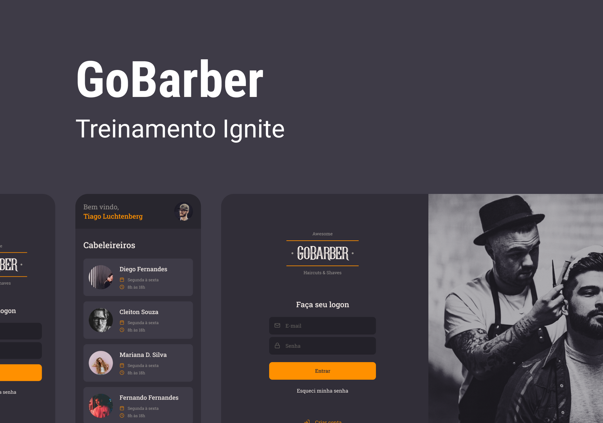

 Hello!

#

## **💻 if you are going to start the project, do the following:**

-  **cd** server
    -  **install the project dependencies:**
        -  **_yarn_**
    -  **initialize a new container 🐟 docker:**    
        -  _docker run --name **GoBarber** -e POSTGRES_PASSWORD=**GoBarber** -p 5432:5432 -d postgres_
        -  **create a new 🎲 database:**    
            -  **CREATE DATABASE** GoBarber;
            -  **USE** GoBarber;
    -  **run all migrations:**
        -  **_yarn_** typeorm migration:**run**
    -  **start:**
        -  **_yarn_** dev
            -  access **http://localhost:3333/**
-  **cd** ../web
    -  **install the project dependencies:**
        -  **_yarn_**
    -  **start:**
        -  **_yarn_** start
-  **cd** ../mobile
    -  **install the project dependencies:**
        -  **_yarn_**
    -  **start:**
        -  **_yarn_** web
        -  **_yarn_** android
        -  **_yarn_** ios

### **🧪 tests**
   -  **_yarn_** test

### **🌌 preview**

-  **(1920 x 1348)**
   

### **🔧 technologies used**

-  node js
-  react native
-  react js
-  expo
-  typeorm
-  cors
-  Jest
-  tsyringe
-  bcrypt
-  Jwt
-  axios
-  api rest
-  postgres
-  typescript
-  eslint
-  prettier
-  git
-  yarn

## **front-end** && **back-end**

